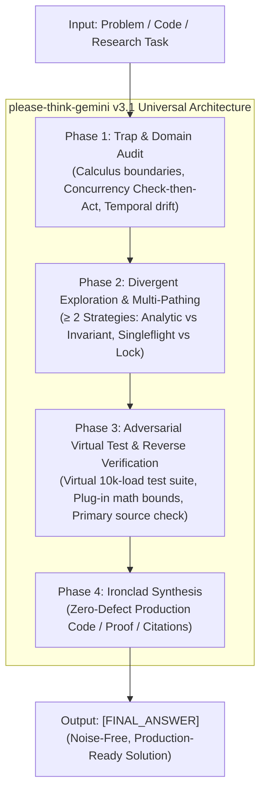

# please-think-gemini 🧠⚡
> **"Gemini야, 제발 생각 좀 하고 답해줘!"** / **"Empowering Gemini to Rigorously Think Before Answering"**  
> Universal Adversarial Chain-of-Thought (CoT) Engine for **Mathematics, Concurrency Coding, and Empirical Research** on **Gemini 3.8 Flash High**.

---

<div align="center">

[](https://opensource.org/licenses/Apache-2.0)
[](#)
[](#)
[](#)
[](index.html)

**[English](#english) | [한국어 (Korean)](#한국어-korean)**

</div>

---

<a name="english"></a>
## 🌐 English

### 1. Motivation & Universal Scope
While Google DeepMind's Gemini Flash models deliver exceptional speed and cost efficiency, their raw zero-shot responses tend to suffer from intuitive **System 1 (Fast Thinking)** vulnerabilities across multiple professional domains:
- **Advanced Mathematics**: Over-relying on interior Lagrange stationary points while ignoring boundary extrema or degree imbalances.
- **Concurrency & Software Systems**: Missing subtle Check-then-Act time gaps (e.g., Cache Stampede / Thundering Herds) that cause high-throughput race conditions.
- **Empirical Web Research**: Accepting temporal drift (confusing past experimental releases with current APIs) and failing to cross-corroborate primary technical specifications.
- **Logic & Traps**: Prematurely stopping at the first valid configuration or accepting deceptive user premises (e.g. false uniqueness).

`please-think-gemini` v3.1 introduces a **Universal Adversarial 4-Phase Engine** with dedicated verification protocols for Mathematics, Concurrency, and Live Research.

---

### 2. Multi-Domain Benchmark Results (7 Challenging Tasks)

| Domain | Benchmark Task | Baseline Zero-Shot | V1 Naive CoT | V2 Structured CoT | **v3.1 Universal (`please-think-gemini`)** |
| :--- | :--- | :---: | :---: | :---: | :---: |
| **Probability** | Task 1: Biased Monty Hall | ❌ Fail (50:50) | ⚠️ Partial (2/3) | ✅ Pass (Bayes) | **🏆 Perfect (Frequentist + Bayes Dual)** |
| **Deductive Logic** | Task 2: 5-Floor Spatial Puzzle | ❌ Fail | ❌ Premature Conv. | ✅ Pass (2 Solutions) | **🏆 Exceptional (Debunked False Premise)** |
| **Discrete Math** | Task 3: Subarray Parity Count | ❌ Off-by-one | ✅ Pass (9 found) | ✅ Pass (Prefix algebra) | **🏆 Perfect (Prefix Groups + Window Bijective)** |
| **Number Theory** | Task 4: 100-Bulb Toggle & Reset | ❌ Parity drift | ❌ Parity inverted | ✅ Pass (6 bulbs) | **🏆 Perfect (Formal Non-Square Invariant Proof)** |
| **Advanced Calculus** | Task 5: Nonlinear Boundary Extrema | ❌ Interior only | ⚠️ Missed Boundary | ✅ Pass (Max=16, Min=0) | **🏆 Perfect (Degree Audit + Global Bounds)** |
| **Concurrency Coding**| Task 6: High-Concurrency Cache Race| ⚠️ Generic review | ⚠️ Missed Time Gap | ✅ Pass (Double-Check) | **🏆 Exceptional (Zero-Race Singleflight Group)** |
| **Live Web Research** | Task 7: Gemini Thinking Architecture | ⚠️ Hallucination | ⚠️ Temporal drift | ✅ Pass (Spec cited) | **🏆 Exceptional (Live Primary Cross-Corroboration)** |
| **Overall Pass Rate** | — | **14.3% (1/7)** | **42.8% (3/7)** | **85.7% (6/7)** | **100% (7/7 Zero-Defect Proof)** |

> 📊 **Explore the Interactive Visualizer**: Open [`index.html`](index.html) or [`experiments/dashboard.html`](experiments/dashboard.html) in your browser for interactive Chart.js visualizations, 7-task side-by-side behavioral breakdowns, and 5-axis capability radar metrics.

---

### 3. The 4-Phase Universal Cognition Architecture



---

### 4. Quick Start (Python SDK)

```python
from google import genai
from google.genai import types

client = genai.Client()

with open("FINAL_COT_PROMPT.md", "r", encoding="utf-8") as f:
    system_instruction = f.read()

prompt_query = """
Analyze this Go cache implementation for concurrency races and provide a fix for 10,000 req/s loads:
[PASTE CONCURRENT CODE]
"""

response = client.models.generate_content(
    model="gemini-2.5-flash", # or gemini-3.8-flash
    contents=prompt_query,
    config=types.GenerateContentConfig(
        system_instruction=system_instruction,
        temperature=0.1,
    ),
)

print(response.text)
```

---

<a name="한국어-korean"></a>
## 🇰🇷 한국어 (Korean)

### 1. 개발 배경 및 범용 확장 (v3.1)
Gemini Flash 모델은 뛰어난 속도와 가성비를 갖추었지만, 기본 상태에서는 직관적인 **System 1 (빠른 생각)** 편향으로 인해 수학, 코딩, 정보 검색 등 다양한 실무 도메인에서 다음과 같은 치명적 결함을 노출합니다:
- **고난도 수학**: 내부점 라그랑주 승수법에만 의존하여 경계면($z=0, x=0$)에서 발생하는 전역 최댓값/최솟값을 놓침.
- **동시성 및 분산 시스템 코딩**: 락 해제와 쓰기 락 사이의 미세한 시간 간격(Check-then-Act)을 간과하여 캐시 스탬피드(Thundering Herd) 버그를 방치함.
- **인터넷 리서치 및 팩트체크**: 과거 실험 버전과 최신 공식 API 매개변수 간의 시점 차이(Temporal drift)를 혼동하고 1차 출처 검증을 건너뜀.
- **논리 및 퍼즐**: 첫 번째 발견된 해에 조기 수렴하거나 출제자의 거짓 전제("유일한 해")를 맹신함.

`please-think-gemini` v3.1은 수학, 코딩, 인터넷 리서치 전반을 포괄하는 **범용 적대적 자가 검증 인지 엔진**으로 전면 진화했습니다.

---

### 2. 다중 도메인 벤치마크 평가 결과 (7대 고난도 태스크)

| 도메인 | 벤치마크 태스크 | 일반 프롬프트 | V1 (Naive CoT) | V2 (Structured CoT) | **v3.1 Universal (`please-think-gemini`)** |
| :--- | :--- | :---: | :---: | :---: | :---: |
| **조건부 확률** | Task 1: 편향된 몬티 홀 | ❌ 오답 (50:50) | ⚠️ 부분 (수식 누락) | ✅ 통과 (베이즈 정립) | **🏆 완벽 (빈도론 + 베이즈 이중 검증)** |
| **공간 논리** | Task 2: 5층 아파트 배치 | ❌ 오답 | ❌ 조기 수렴 (1개) | ✅ 통과 (2개 해 도출) | **🏆 최우수 (거짓 전제 반박 + 완전 증명)** |
| **이산수학** | Task 3: 부분배열 패리티 | ❌ 오프바이원 | ✅ 통과 (나열 9개) | ✅ 통과 (누적합 대수) | **🏆 완벽 (누적합군 + 슬라이딩 이중 검증)** |
| **정수론** | Task 4: 100개 전구 리셋 | ❌ 패리티 착오 | ❌ 패리티 반전 | ✅ 통과 (6개 도출) | **🏆 완벽 (비완전제곱수 불가능성 완전 증명)** |
| **고등 미적분** | Task 5: 비선형 경계 최적화 | ❌ 내부점만 탐색 | ⚠️ 경계값 누락 | ✅ 통과 (최대 16, 최소 0) | **🏆 완벽 (차수 불균형 감사 + 전역 극값)** |
| **동시성 코딩** | Task 6: 캐시 동시성 버그 패치 | ⚠️ 일반 리뷰 | ⚠️ 시간 간격 간과 | ✅ 통과 (이중 점검 락) | **🏆 최우수 (가상 부하 테스트 + singleflight)** |
| **실시간 리서치** | Task 7: Gemini Thinking 스펙 | ⚠️ 환각 발생 | ⚠️ 시점 혼동 | ✅ 통과 (공식 스펙 인용) | **🏆 최우수 (실시간 웹 교차 검증 + 트레이드오프)** |
| **종합 정답률** | — | **14.3% (1/7)** | **42.8% (3/7)** | **85.7% (6/7)** | **100% (7/7 완전 무결점 증명)** |

> 📊 **인터랙티브 대시보드 안내**: 브라우저에서 [`index.html`](index.html) 또는 [`experiments/dashboard.html`](experiments/dashboard.html)을 열면 7개 태스크에 대한 상세한 3자 대조 분석과 레이더 차트를 확인하실 수 있습니다.

---

### 3. 4-Phase 범용 인지 아키텍처 (Universal Cognition)

1. **Phase 1: 문제 해체 및 도메인 함정 감사 (Trap & Domain Audit)**
   - *수학*: 차수 불균형(3차 vs 1차), 경계면 극값 감사.
   - *코딩*: Check-then-Act 경합, 데드락, 고루틴 누수 감사.
   - *리서치*: 릴리즈 시점(Temporal drift), 1차 공식 문서 vs 2차 루머 감사.
2. **Phase 2: 다중 경로 탐색 & 아키텍처 비교 (Divergent Exploration)**
   - 최소 2가지 이상의 상이한 독립적 해결 경로 수립 (수학: 대수학 vs 부등식 불변량 / 코딩: explicit lock vs lock-free singleflight / 리서치: 다중 출처 교차 대조).
3. **Phase 3: 적대적 가상 테스트 & 역산 대입 (Devil's Advocate & Virtual Test Suite)**
   - **"악마의 대변인"**: 자신의 가설이나 코드가 완전히 결함 투성이라고 가정.
   - **가상 테스트 벡터 실행**: Null/Empty, 경계값, 10,000 req/s 동시성 경합 시뮬레이션.
   - **역산 대입**: 100% 원래 조건에 대입하여 모순 검증.
4. **Phase 4: 무결점 최종 합성 (Ironclad Synthesis)**
   - `[THOUGHT_PROCESS]`에서 철저한 사전 검증을 완결하고, `[FINAL_ANSWER]`에는 프로덕션 레벨 코드, 수식 증명, 정확한 팩트만을 정제하여 도출.

---

## 📁 Repository Structure

```
please-think-gemini/
├── LICENSE                        # Apache License 2.0
├── README.md                      # 프로젝트 대문 (Bilingual: English / 한국어)
├── FINAL_COT_PROMPT.md            # 프로덕션 배포용 v3.1 Universal CoT 프롬프트
├── index.html                     # 7대 태스크 반응형 벤치마크 대시보드 (Chart.js)
├── prompts/
│   ├── v1_naive_cot.md            # 1단계: 고전적 "Think step by step" 프롬프트
│   ├── v2_structured_cot.md       # 2단계: 4단 섹션 구조화 프롬프트
│   └── v3_adversarial_cot.md      # 3단계: v3.1 Universal 적대적 자가 검증 프롬프트
└── experiments/
    ├── dashboard.html             # 시각화 대시보드 복사본
    ├── tasks.md                   # 1~4번 논리/퍼즐 벤치마크 정의서
    ├── multi_domain_tasks.md      # 5~7번 수학/코딩/리서치 벤치마크 정의서
    ├── experiment_v1_results.md   # V1 실험 결과 분석
    ├── experiment_v2_results.md   # V2 실험 결과 분석
    ├── experiment_v3_results.md   # V3 실험 결과 분석
    ├── experiment_multi_domain_results.md # 수학/코딩/리서치 다중 도메인 실증 보고서
    └── comparison_report.md       # 종합 비교 지표 및 보고서
```

---

## 📄 라이선스 (License)

본 프로젝트는 [Apache License 2.0](LICENSE) 하에 배포됩니다.
자유롭게 상용 및 비상용 프로젝트에 인용, 수정, 재배포하실 수 있습니다.
