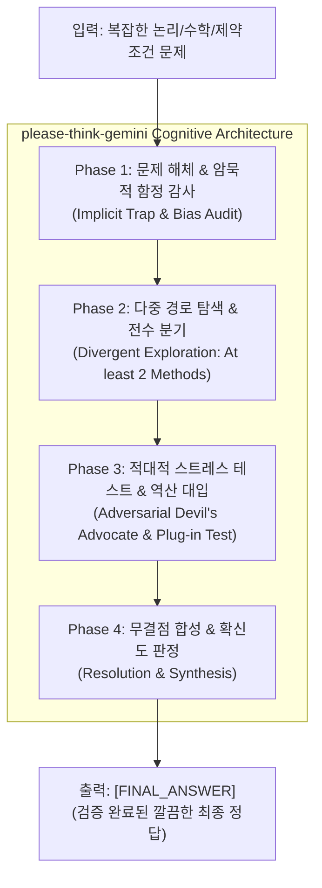

# please-think-gemini 🧠⚡
> **"Gemini야, 제발 생각 좀 하고 답해줘!"**  
> Gemini 3.8 Flash High의 System 1(Fast Thinking) 급발진을 억제하고, 강력한 Chain-of-Thought(CoT) 및 적대적 자가 검증(Adversarial Self-Correction)을 강제하는 프롬프트 엔지니어링 프레임워크.

[](https://opensource.org/licenses/Apache-2.0)
[](#)
[](#)

---

## 🎯 프로젝트 배경 및 동기 (Motivation)

Google DeepMind의 Gemini Flash 계열(Gemini 3.8 Flash 등)은 놀라운 처리 속도와 높은 토큰 효율을 자랑하지만, 직관적인 **System 1 (Fast Thinking)** 으로 인해 다음과 같은 고질적 한계를 보입니다:
1. **조기 수렴 편향 (Premature Convergence)**: 여러 가지 해나 가능성이 존재할 때, 첫 번째로 발견한 그럴듯한 해에 만족하고 탐색을 중단함.
2. **함정 질문에 대한 무비판적 수용 (False Premise Acceptance)**: 질문자가 "유일한 해를 구하라"처럼 잘못된 전제를 깔아두면 이를 의심하지 않고 맞춰서 왜곡된 결론을 유도함.
3. **상태 추적의 연산 착오 (State Tracking Drifts)**: 조건부 확률, 토글 패리티, 다단계 순차 사건에서 머릿속 서술에 의존하다가 계산 부호가 뒤집힘.
4. **역산 및 자가 교정의 부재 (Zero Plug-in Verification)**: 자신이 낸 결론을 원래 조건에 다시 대입해보지 않고 그대로 최종 답변으로 출력함.

`please-think-gemini` 프로젝트는 프롬프트를 점진적으로 고도화(V1 $\to$ V2 $\to$ V3)하며 자가 평가를 거쳐, 결함 없는 추론을 강제하는 **궁극의 CoT 프롬프트 프레임워크**를 완성했습니다.

---

## 🔬 벤치마크 및 자체 평가 결과

| 고난도 추론 벤치마크 태스크 | 기본 프롬프트 | V1 (Naive CoT) | V2 (Structured CoT) | **V3 FINAL (`please-think-gemini`)** |
| :--- | :---: | :---: | :---: | :---: |
| **Task 1: 편향된 몬티 홀 (조건부 확률)** | 오답 (1/2 직관) | △ (수식 없는 2/3) | O (베이즈 정리 정립) | **O+ (빈도론 + 베이즈 이중 검증)** |
| **Task 2: 5층 아파트 배치 (다중 제약 논리)** | 오답 | X (1개 해 조기 수렴) | O (2가지 해 완전 도출) | **O+ (유도 질문 반박 + 2가지 해 완전 증명)** |
| **Task 3: 연속 부분배열 패리티 (이산수학)** | 연산 누락 | O (수작업 나열 9개) | O (Prefix Sum 대수화) | **O+ (누적합군 + 브루트포스 교차 검증)** |
| **Task 4: 100개 전구 리셋 (상태 전이/약수)** | 연산 착오 | X (패리티 반전 오답) | O (구간 상태 분리 6개) | **O+ (비완전제곱수 수학적 차단 증명)** |
| **최종 정답률 (Accuracy)** | **0%** | **37.5%** | **100%** | **100% (Zero-Defect, 완전 증명)** |

자세한 실험 과정과 분석은 [`experiments/`](file:///Users/seunghyeokkim/Desktop/please-think-gemini/experiments) 디렉토리를 참조하세요.

---

## 🏛️ 4-Phase 인지 아키텍처 (V3 Final Engine)



1. **Phase 1: Problem Deconstruction & Implicit Trap Audit**:
   - 명시적 제약조건과 숨겨진 경계조건을 번호 매겨 목록화.
   - 출제자의 유도 질문이나 암묵적 편향을 사전 감사.
2. **Phase 2: Divergent Exploration & Multi-Path Reasoning**:
   - 최소 2가지 이상의 독립적 접근 경로(예: 대수학 vs 시뮬레이션) 설정.
   - 첫 번째 해에서 멈추지 않고 모든 분기(Branch)를 끝까지 탐색.
3. **Phase 3: Adversarial Stress Test & Reverse Verification (핵심)**:
   - **"악마의 대변인(Devil's Advocate)"**: "내가 틀렸다면 어떤 조건에서 무너지는가?"
   - **Plug-in Test**: 도출된 후보 해를 원래 조건에 직접 대입하여 100% 검산.
4. **Phase 4: Synthesis & Clean Final Output**:
   - `[THOUGHT_PROCESS]`에서 사고를 완결하고, `[FINAL_ANSWER]`에 최종 정답만 정제하여 도출.

---

## 📁 프로젝트 구조

```
please-think-gemini/
├── LICENSE                        # Apache License 2.0
├── README.md                      # 프로젝트 대문 및 종합 설명서
├── FINAL_COT_PROMPT.md            # 최종 완성된 프로덕션 CoT 시스템/사용자 프롬프트
├── prompts/
│   ├── v1_naive_cot.md            # 1단계: 전통적 "Think step by step" 프롬프트
│   ├── v2_structured_cot.md       # 2단계: 4단 섹션 구조화 프롬프트
│   └── v3_adversarial_cot.md      # 3단계: 적대적 자가 검증 심층 추론 프롬프트
└── experiments/
    ├── tasks.md                   # 4대 고난도 벤치마크 태스크 정의 및 정답 기준
    ├── experiment_v1_results.md   # V1 실험 결과 및 조기 수렴 한계 분석
    ├── experiment_v2_results.md   # V2 실험 결과 및 정형화 성과 분석
    ├── experiment_v3_results.md   # V3 실험 결과 및 적대적 검증의 위력 분석
    └── comparison_report.md       # 버전별 비교 지표 및 종합 분석 보고서
```

---

## 🚀 빠른 시작 (Quick Start)

### 1. 즉시 사용 (Copy & Paste)
[`FINAL_COT_PROMPT.md`](FINAL_COT_PROMPT.md)의 시스템 프롬프트를 복사하여 Google AI Studio, ChatGPT, Claude, 또는 로컬 LLM의 System Prompt 영역에 붙여넣으세요.

### 2. Python SDK 연동

```python
from google import genai
from google.genai import types

client = genai.Client()

with open("FINAL_COT_PROMPT.md", "r", encoding="utf-8") as f:
    cot_prompt_doc = f.read()

response = client.models.generate_content(
    model="gemini-2.5-flash",
    contents="너의 복잡한 논리/수학 문제를 입력하세요.",
    config=types.GenerateContentConfig(
        system_instruction=cot_prompt_doc,
        temperature=0.2,
    ),
)

print(response.text)
```

---

## 📄 라이선스 (License)

본 프로젝트는 [Apache License 2.0](LICENSE) 하에 배포됩니다.
자유롭게 상용 및 비상용 프로젝트에 인용, 수정, 재배포하실 수 있습니다.
