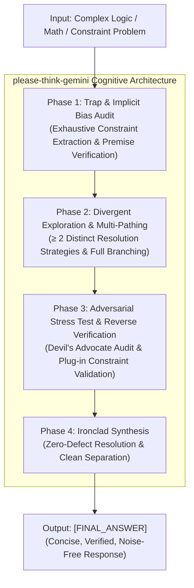

# please-think-gemini 🧠⚡
> **"Gemini야, 제발 생각 좀 하고 답해줘!"** / **"Empowering Gemini to Rigorously Think Before Answering"**  
> Suppressing System 1 (Fast Thinking) Reflexes via Adversarial Verification & Cognitive Phasing on **Gemini 3.8 Flash High**.

---

<div align="center">

[](https://opensource.org/licenses/Apache-2.0)
[](#)
[](#)
[](index.html)

**[English](#english) | [한국어 (Korean)](#한국어-korean)**

</div>

---

<a name="english"></a>
## 🌐 English

### 1. Motivation
While models in the Gemini Flash family (e.g., Gemini 3.8 Flash) offer exceptional throughput and efficiency, their default single-shot or unguided behavior often defaults to intuitive **System 1 (Fast Thinking)** shortcuts:
- **Premature Convergence**: Terminating exploration upon encountering the first plausible candidate, missing alternate or multiple valid solutions.
- **Trap Vulnerability**: Accepting deceptive premises from queries (e.g., claiming a unique solution exists when multiple exist).
- **State Space Drifts**: Losing track of arithmetic signs or parity shifts in sequential multi-step simulations without explicit state matrices.
- **Zero Reverse Verification**: Outputting conclusions without plug-in testing against initial boundary conditions.

`please-think-gemini` introduces an adversarial, multi-path reasoning framework that forces Gemini into deep, self-correcting deliberation.

---

### 2. Benchmark Evaluation Summary

Tested across 4 rigorous benchmark tasks requiring multi-step state tracking, Bayesian updates, and discrete mathematics:

| Benchmark Task | Baseline Zero-Shot | V1 Naive CoT | V2 Structured CoT | **V3 FINAL (`please-think-gemini`)** |
| :--- | :---: | :---: | :---: | :---: |
| **Task 1: Biased Monty Hall** | ❌ Fail (50:50 bias) | ⚠️ Partial (2/3 intuition) | ✅ Pass (Bayes formula) | **🏆 Perfect (Frequentist + Bayes Dual Check)** |
| **Task 2: 5-Floor Spatial Puzzle** | ❌ Fail | ❌ Fail (Single solution bias) | ✅ Pass (2 solutions found) | **🏆 Exceptional (Debunked Premise + Full Proof)** |
| **Task 3: Contiguous Parity Subarrays**| ❌ Fail (Off-by-one) | ✅ Pass (Brute-force 9) | ✅ Pass (Prefix Sum algebra) | **🏆 Perfect (Prefix Parity + Bijective Window)** |
| **Task 4: 100-Bulb Toggle & Reset** | ❌ Fail (Parity drift)| ❌ Fail (Parity inverted) | ✅ Pass (State separation 6) | **🏆 Perfect (Formal Invariant Impossibility Proof)** |
| **Overall Pass Rate** | **0%** | **37.5%** | **100%** | **100% (Zero-Defect Proof)** |

> 📊 **Explore the Interactive Visualizer**: Open [`index.html`](index.html) or [`experiments/dashboard.html`](experiments/dashboard.html) in your browser for interactive Chart.js visualizations, radar metrics, and side-by-side behavioral breakdowns.

---

### 3. The 4-Phase Cognition Architecture



1. **Phase 1: Problem Deconstruction & Implicit Trap Audit**: Enumerates explicit rules and questions false prompt premises.
2. **Phase 2: Divergent Exploration & Multi-Path Reasoning**: Establishes at least two independent pathways (e.g. analytical vs. discrete brute-force) and forbids premature stopping.
3. **Phase 3: Adversarial Stress Test (Devil's Advocate)**: Assumes the tentative answer is flawed, tests edge cases, and performs line-by-line reverse plug-in verification.
4. **Phase 4: Synthesis**: Decouples messy deliberation inside `[THOUGHT_PROCESS]` and outputs verified results cleanly under `[FINAL_ANSWER]`.

---

### 4. Quick Start (Python SDK)

```python
from google import genai
from google.genai import types

client = genai.Client()

# Read the production prompt
with open("FINAL_COT_PROMPT.md", "r", encoding="utf-8") as f:
    system_instruction = f.read()

prompt_query = "Five developers live on floors 1-5 under specific rules... [YOUR PROBLEM]"

response = client.models.generate_content(
    model="gemini-2.5-flash", # or gemini-3.8-flash
    contents=prompt_query,
    config=types.GenerateContentConfig(
        system_instruction=system_instruction,
        temperature=0.2, # Recommended: low temperature for deterministic deduction
    ),
)

print(response.text)
```

---

<a name="한국어-korean"></a>
## 🇰🇷 한국어 (Korean)

### 1. 개발 배경 및 동기
Google DeepMind의 최신 고속 모델인 Gemini Flash(예: Gemini 3.8 Flash)는 빠른 속도와 압도적인 토큰 효율을 자랑하지만, 기본 zero-shot 환경에서는 직관적인 **System 1 (Fast Thinking, 빠른 생각)** 에 의존하여 다음과 같은 인지적 함정에 빠지기 쉽습니다:
- **조기 수렴 편향 (Premature Convergence)**: 가능한 해가 여러 개 존재함에도 불구하고, 첫 번째로 발견한 그럴듯한 하나의 해에 멈춰 탐색을 중단함.
- **질문자의 거짓 전제 수용 (False Premise Trap)**: "유일한 해를 구하라"는 식의 함정 유도 질문을 그대로 믿고 오답을 정당화함.
- **상태 추적 연산 착오**: 다단계 순차 토글 및 조건부 확률 문제에서 엄밀한 수식이나 상태 테이블 없이 서술하다가 홀짝 부호가 반전됨.
- **역산 및 자가 교정 결여**: 자신이 도출한 후보 해를 원래 제약조건에 다시 대입해보는 사후 검증이 전무함.

`please-think-gemini` 프로젝트는 프롬프트를 점진적으로 고도화(V1 $\to$ V2 $\to$ V3)하며 자가 평가를 거쳐, 결함 없는 추론을 강제하는 **궁극의 CoT 프롬프트 프레임워크**를 완성했습니다.

---

### 2. 자체 벤치마크 평가 결과 요약

엄밀한 상태 추적, 베이지안 갱신, 이산수학적 엄밀성이 요구되는 4가지 고난도 벤치마크 태스크에 대해 평가를 수행했습니다:

| 벤치마크 태스크 | 일반 프롬프트 | V1 (Naive CoT) | V2 (Structured CoT) | **V3 FINAL (`please-think-gemini`)** |
| :--- | :---: | :---: | :---: | :---: |
| **Task 1: 편향된 몬티 홀 (조건부 확률)** | 오답 (1/2 직관) | △ (수식 없는 2/3) | O (베이즈 정리 정립) | **🏆 완벽 (빈도론 + 베이즈 이중 검증)** |
| **Task 2: 5층 아파트 배치 (공간 논리)** | 오답 | X (1개 해 조기 수렴) | O (2가지 해 완전 도출) | **🏆 최우수 (유도 질문 반박 + 2가지 해 완전 증명)** |
| **Task 3: 연속 부분배열 패리티 (이산수학)** | 연산 누락 | O (수작업 나열 9개) | O (Prefix Sum 대수화) | **🏆 완벽 (누적합군 + 브루트포스 교차 검증)** |
| **Task 4: 100개 전구 리셋 (상태 전이/약수)** | 연산 착오 | X (패리티 반전 오답) | O (구간 상태 분리 6개) | **🏆 완벽 (비완전제곱수 불가능성 완전 증명)** |
| **종합 정답률 (Pass Rate)** | **0%** | **37.5%** | **100%** | **100% (Zero-Defect, 완전 증명)** |

> 📊 **인터랙티브 시각화 대시보드**: 브라우저에서 [`index.html`](index.html) 또는 [`experiments/dashboard.html`](experiments/dashboard.html)을 열면 인터랙티브 Chart.js 차트, 다차원 역량 레이더 차트, 태스크별 3자 대조 뷰어를 확인하실 수 있습니다.

---

### 3. 4-Phase 인지 아키텍처

1. **Phase 1: 문제 해체 및 암묵적 함정 감사 (Trap & Bias Audit)**
   - 명시적 제약조건과 숨겨진 경계조건을 번호 매겨 전수 추출.
   - 출제자의 유도 질문이나 불필요한 휴리스틱 편향을 사전 감사.
2. **Phase 2: 다중 경로 탐색 & 전수 분기 (Divergent Exploration)**
   - 최소 2가지 이상의 상이한 독립적 풀이 경로(예: 대수학적 해석 vs 브루트포스 시뮬레이션) 설정.
   - 첫 번째 발견된 해에서 멈추지 않고 모든 분기(Branch)를 끝까지 탐색.
3. **Phase 3: 적대적 스트레스 테스트 & 역산 대입 (Devil's Advocate)**
   - **"악마의 대변인"**: "내 가설이 완전히 틀렸다면 어디서 무너지는가?"를 적극적으로 공격.
   - **Plug-in Test**: 도출된 후보 해를 원래 조건 하나하나에 직접 대입하여 100% 일치 검증.
4. **Phase 4: 무결점 최종 합성 (Ironclad Synthesis)**
   - `[THOUGHT_PROCESS]` 내부에서 지저분한 심층 검증을 완결하고, `[FINAL_ANSWER]`에는 사용자에게 필요한 정제된 최종 결과만 노출.

---

## 📁 Repository Structure

```
please-think-gemini/
├── LICENSE                        # Apache License 2.0
├── README.md                      # 프로젝트 대문 (Bilingual: English / 한국어)
├── FINAL_COT_PROMPT.md            # 프로덕션 배포용 최종 CoT 시스템/사용자 프롬프트
├── index.html                     # 반응형 인터랙티브 벤치마크 대시보드 (Chart.js)
├── prompts/
│   ├── v1_naive_cot.md            # 1단계: 고전적 "Think step by step" 프롬프트
│   ├── v2_structured_cot.md       # 2단계: 4단 섹션 구조화 프롬프트
│   └── v3_adversarial_cot.md      # 3단계: 적대적 자가 검증 심층 추론 프롬프트
└── experiments/
    ├── dashboard.html             # 시각화 대시보드 복사본
    ├── tasks.md                   # 4대 고난도 벤치마크 문제 정의서
    ├── experiment_v1_results.md   # V1 실험 결과 및 조기 수렴 한계 분석
    ├── experiment_v2_results.md   # V2 실험 결과 및 구조화 성과 분석
    ├── experiment_v3_results.md   # V3 실험 결과 및 적대적 검증의 위력 분석
    └── comparison_report.md       # 버전별 비교 지표 및 종합 분석 보고서
```

---

## 📄 라이선스 (License)

본 프로젝트는 [Apache License 2.0](LICENSE) 하에 배포됩니다.
자유롭게 상용 및 비상용 프로젝트에 인용, 수정, 재배포하실 수 있습니다.
